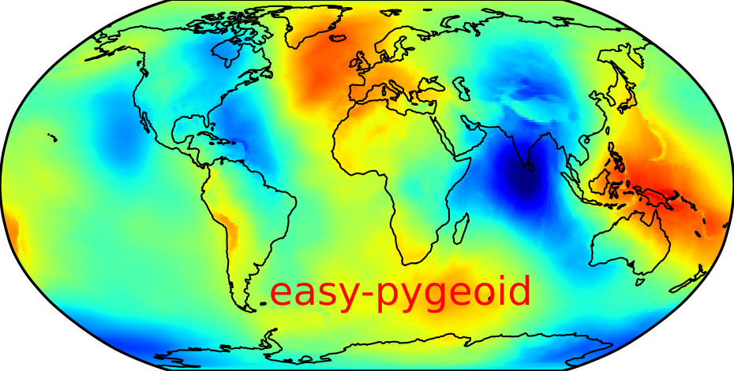

# easy-pygeoid     

<div align="center">
  
</div>

<p></p>
                                                                                  

**`easy-pygeoid` is a highly automated Python package developed for easy geoid modeling.**


The package comes packed with utilities for estimating a geoid model using Stokes' method, with options for:

- the original Stokes' kernel
- Wong and Gore's modification of Stokes' kernel
- Heck and Gruninger's modification of Stokes' kernel
- Terrain correction
- Residual Terrain Modeling (RTM)

`easy-pygeoid` uses the remove-compute-restore (RCR) method for geoid calculation. It is designed to be almost entirely automated.

- Automatically downloads [SRTM30PLUS](https://topex.ucsd.edu/pub/srtm30_plus/srtm30/grd/) over the bounding box of interest
- Automatically downloads a GGM from [ICGEM](https://icgem.gfz-potsdam.de/tom_longtime)
- Uses a template file so that users do not have to interact with the scripts

## Installation
`easy-pygeoid` can be installed using conda/mamba or pip.
  
```
conda create -n geoid_env -y
mamba install -c conda-forge easy-pygeoid -y
```      
Test installation

```
compute_geoid.py -h
compute_reference_geoid.py -h
```
## Examples
- Prepare data: This includes all relevant data for your study area
  Terrestrial gravity data
  Marine gravity data
  Global Geopotential Model (GGM). `easy-pygeoid` can automatically download this. Just provide the name of the GGM in the template file
  Digital Elevation Model (DEM). `easy-pygeoid` presently downloads SRTM30PLUS
- Ensure that the terrestrial gravity data has columns `lon`, `lat`, `gravity`, and `height`. If you are providing gravity anomalies,
  ensure that they are free-air anomalies
- Call `compute_geoid.py --start [step]`

See the [tutorial repo](https://github.com/cikelly/easy-pygeoid-tutorial) for examples of using `easy-pygeoid`.

## References
- Yakubu, C. I., Ferreira, V. G. and Asante, C. Y., (2017): [Towards the Selection of an Optimal Global Geopotential
Model for the Computation of the Long-Wavelength Contribution: A Case Study of Ghana, Geosciences, 7(4), 113](http://www.mdpi.com/2076-3263/7/4/113)

- C. I. Kelly, S. A. Andam-Akorful, C. M. Hancock, P. B. Laari & J. Ayer (2021): [Global gravity models and the Ghanaian vertical datum: challenges of a proper definition, Survey Review, 53(376), 44–54](https://doi.org/10.1080/00396265.2019.1684006)

- Featherstone, W.E. (2003): [Software for computing five existing types of deterministically modified integration kernel for gravimetric geoid determination, Computers & Geosciences, 29(2)](http://linkinghub.elsevier.com/retrieve/pii/S0098300402000742)

- Holmes, S.A. and Featherstone, W.E., (2022): [A unified approach to the Clenshaw summation and the recursive computation of very high degree and order normalised associated Legendre functions, Journal of Geodesy, 76(5), 279-299](https://link.springer.com/article/10.1007/s00190-002-0216-2)
