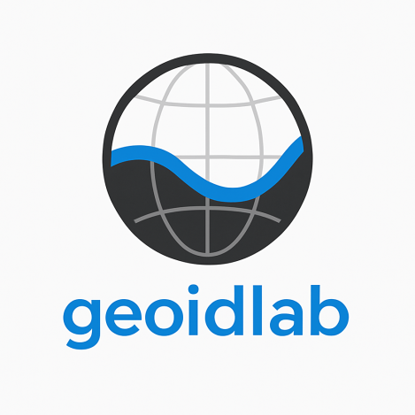

# GeoidLab

[](https://www.python.org/)
[](https://pypi.org/project/geoidlab/)
[](LICENSE)
[](https://github.com/cikelly/geoidlab/actions)
[](https://geoidlab.readthedocs.io/en/latest/?badge=latest)
[](https://github.com/cikelly/geoidlab/releases)

---
<div align="center">
  
</div>

<p></p>

**`GeoidLab`: A Modular and Automated Python Package for Geoid Computation.**


## Table of Contents
- [Introduction](#introduction)
- [Features](#features)
- [Installation](#installation)
- [Command-Line Interface](#command-line-interface)
- [Examples](#examples)
- [Contributing](#contributing)
- [License](#license)
- [References](#references)

---

## Introduction
`GeoidLab` is a Python package that implements the remove-compute-restore (RCR) method for geoid determination. It provides a comprehensive command-line interface for automated geoid computation, handling everything from data preparation to final geoid model generation. Its design also allows for teaching and learning.

## Features

### Core Functionality
- **Complete RCR Implementation**: Handles all steps of the remove-compute-restore method:
  - Gravity reduction (free-air anomalies)
  - Terrain correction
  - Synthesis of functionals from a global geopotential model (GGM)
  - Residual gravity anomaly computation and gridding
  - Geoid computation with multiple kernel options
  - Final model restoration

- **Modeling Topographic Quantities**
  - Supports automatic download of DEMs: SRTM30PLUS, SRTM, COP, GEBCO, NASADEM
  - Terrain correction (Direct Topographic Effect)
  - Indirect effect (Primary Indirect Topographic Effect)
  - Secondary indirect effect (Secondary Indirect Topographic Effect)
  - Residual Terrain Modeling (RTM)
  - RTM Height Anomaly
 
- **Support methods for solving stokes' integral**
  - Heck & Gruninger (hg)
  - Wong & Gore (wg)
  - Original Stokes' (og)
  - Meissl (ml)

- **Global Geopotential Model**
  - Automatic download of GGMs from ICGEM: [static models](https://icgem.gfz-potsdam.de/tom_longtime)
  - Synthesis of gravity field functionals:
     - Gravity anomalies
     - Gravity disturbance
     - Disturbing potential
     - Second radial derivative of gravity (vertical gradient)
     - Height anomalies
     - Geoid (with optional zero degree term correction)
     - Geoid-quaisi geoid separation
     - First derivative of disturbing potential
     - Ellipsoidal correction (needed for geoid computation)

- **Tide System Conversion**
  - Support for tide system conversion for gravity and geoid. Supported systems:
     - mean tide
     - tide free
     - zero tide
  - Automated tide system conversion in geoid workflow

- **Legendre Functions and Polynomials**
  - Legendre polynomials
  - Fully normalized associated Legendre Functions (ALFs)
  - Derivative of ALFs with respect to co-latitude

- **Plotting Utilities**
  - Publication-ready plotting of gridded data
  - Support for all `matplotlib` colormaps and `.cpt` (GMT) colormaps
  - Options for scalebar

### Additional Computational Features
- **Advanced Gridding Options**:
  - Multiple interpolation methods (linear, spline, kriging, lsc, etc.)
  - Flexible grid size and unit specifications
  - Customizable computation windows for residual geoid and terrain quantity computations

### Reference Systems
- Supports both WGS84 and GRS80 reference ellipsoids
- Handles various coordinate transformations and corrections

## Installation
`GeoidLab` can be installed using `pip`. `conda`/`mamba` installation planned for future

### Recommended
Install the development version. Navigate to your directory of choice (where `geoidlab` will be downloaded to). Example:

- Create conda environment (optional but recommended to avoid dependency conflicts
```bash
conda create -n geoid_env
conda activate geoid_env
```

- Create directory to download geoidlab to and install package
```bash
cd ~ && mkdir tools && cd tools
git clone https://github.com/cikelly/geoidlab.git
cd geoidlab
pip install -e .
```

### Using Pip
```bash
pip install geoidlab
```

## Command-Line Interface
`GeoidLab` provides a comprehensive CLI with subcommands for all of the major components of `geoidlab`. One of the major advantages of `geoidlab` is that users may choose to interact with `geoidlab` via a configuration file, thus eliminating the need for expertise in Python programming. The available CLI commands are:
- ggm     (synthesizing gravity field functionals from a GGM)
- topo    (modeling topographic quantities)
- reduce  (gravity reduction)
- viz     (plotting)
- geoid   (entire RCR workflow)
- ncinfo  (print information about a NetCDF file)

```bash
# Basic command structure
geoidlab <command> [options]

# Available commands
geoidlab geoid    # Complete geoid computation using RCR method
geoidlab reduce   # Perform gravity reductions
geoidlab topo     # Compute topographic quantities
geoidlab viz      # Visualize results

# Use the -h or --help flag to print useful information about the commands
geoidlab -h         # Print help message for geoidlab
geoidlab geoid -h   # Print help message for geoid command
geoidlab viz --help # Print help message for (viz) visualization command
```

### Geoid Computation Workflow
The simplest way to use `GeoidLab` for geoid computation is via the CLI tools and the configuration file. Follow these steps to use CLI + configuration file for geoid computation:
1. **Directory Setup**: Create a directory (e.g., `Brazil`) where you will store the surface gravity data (and marine gravity anomalies if available).
   ```bash
   mkdir Brazil && cd Brazil
   # Ensure you copy your surface gravity data (and marine anomalies) to Brazil
   ```
   
2. **Copy default configuration file to `Brazil`**
   ```bash
   # Use geoidlab -c or geoidlab --config to create a copy of geoidlab.cfg in CWD
   geoidlab -c
   ```
   
3. Open `geoidlab.cfg` in a text editor and edit to your satisfaction. For geoid computation, `command` must be set to `geoid`.
   
5. **Execute CLI and wait for `geoidlab` to do its thing
   ```bash
   geoidlab -c geoidlab.cfg
   ```

By default, `geoidlab` will create a project directory, `GeoidProject`, in `cwd`. If you didn't change this, you can find results and downloads in `Brazil/GeoidProject/results` and `Brazil/GeoidProject/downloads`. 

**PS**: For computationally extensive steps, `geoidlab` will skip reprocessing if NetCDF files are found in `<proj-name/results>`. If you have made changes and want to recompute them, either delete them, move them, or set `<proj-name>` to a new value.

Alternatively, if you are comfortable with CLI tools and want to use the different commands separately without the configuration file, please use `geoidlab <command> -h` to get helpful information about usage. Some steps include:

1. **Data Preparation**
   ```bash
   # Process terrestrial gravity data
   geoidlab reduce --input gravity.csv --model EGM2008 \
                   --grid-size 1 --grid-unit minutes \
                   --bbox [-5,5,-5,5] --grid-method kriging
   ```

2. **Residual Computation**
   ```bash
   # Compute residual geoid using Heck & Gruninger modification
   geoidlab geoid --method hg --sph-cap 1.0 \
                  --max-deg 90 --window-mode cap
   ```

3. **Final Geoid Model**
   ```bash
   # Generate final geoid with tide system conversion
   geoidlab geoid --target-tide-system tide_free \
                  --gravity-tide mean_tide
   ```

### Key Parameters
- `--method`: Kernel modification ['hg', 'wg', 'ml', 'og']
- `--grid-method`: Interpolation method ['linear', 'spline', 'kriging', 'rbf', 'idw']
- `--tide-system`: Tide system ['mean_tide', 'zero_tide', 'tide_free']
- `--ellipsoid`: Reference ellipsoid ['wgs84', 'grs80']

## Examples
If you are interested in more detailed usage examples, please visit the [tutorial repository](https://github.com/cikelly/geoidlab-tutorial). Examples include:
- Complete workflow demonstrations
- Different kernel modification comparisons
- Data preparation guides
- Visualization examples
- Gridding

The package includes example Jupyter notebooks in the `Notebooks/` directory that demonstrate various aspects of geoid computation.

## Contributing
We welcome contributions! To contribute:
1. Fork the repository.
2. Clone your fork and set up a development environment:
   ```bash
   git clone https://github.com/your-username/geoidlab.git
   cd geoidlab
   pip install -e .
   ```
3. Create a new branch for your feature or bug fix.
4. Submit a pull request.
5. You may also contribute by helping improve the documentation.

## License
This project is licensed under the GNU General Public License v3.0 (GPL-3.0). See the [LICENSE](LICENSE) file for details.


See the [tutorial repo](https://github.com/cikelly/geoidlab-tutorial) for detailed examples of using `GeoidLab`.


## References
- Yakubu, C. I., Ferreira, V. G. and Asante, C. Y., (2017): [Towards the Selection of an Optimal Global Geopotential
Model for the Computation of the Long-Wavelength Contribution: A Case Study of Ghana, Geosciences, 7(4), 113](http://www.mdpi.com/2076-3263/7/4/113)

- C. I. Kelly, S. A. Andam-Akorful, C. M. Hancock, P. B. Laari & J. Ayer (2021): [Global gravity models and the Ghanaian vertical datum: challenges of a proper definition, Survey Review, 53(376), 44–54](https://doi.org/10.1080/00396265.2019.1684006)
